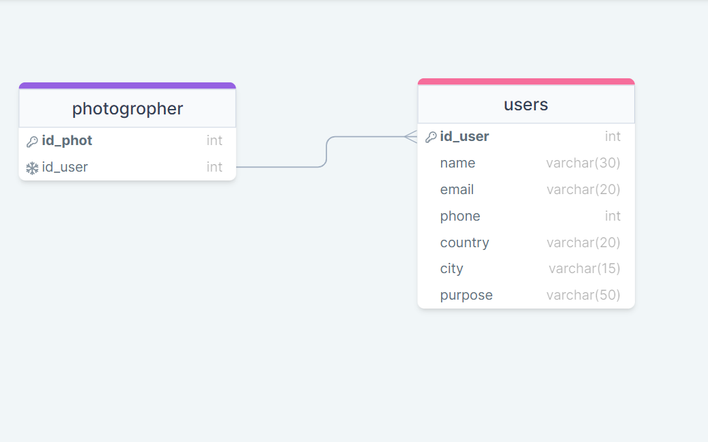

# Project-Postgres-SQL

## live website
* this is The Live Website : https://photogrophy.onrender.com 
## Description 
This is an Express and postgressql web application that aims to provide an photogrophers. This project through which a photographer is booked for a customer by submitting a reservation request where the photographer has several clients.

## User Stories 

* As a user, I can book a photographer.

----

## Features 🌟

* Simple UI
* Using Database Postgres SQL
* Clean and simple user interface
* Mobile-friendly design
* Usefully website
* Build Project in Postgres SQL

---
## Usage
* Start the server:   npm run dev
* Open a web browser and navigate to http://localhost:8000.
* Submit a request to book a photographer.

----

## Used Technologies 👨‍💻

* HTML
* CSS
* JavaScript
* Node.js
* Server
* Express
* PostgresSQl
